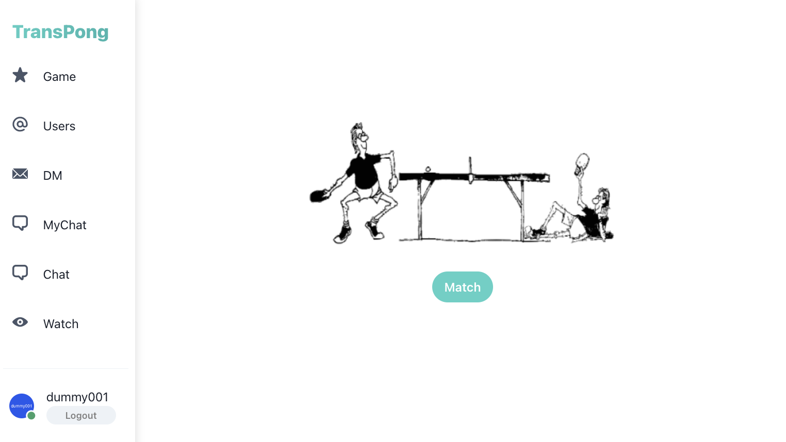
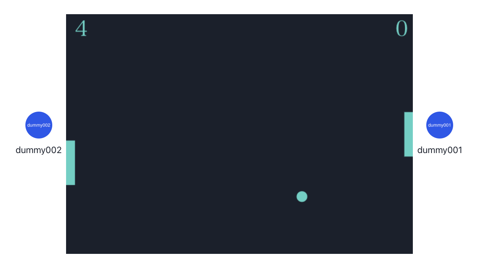

# ft_transcendence

このプロジェクトでは、React, NestJS, PostgreSQL等を使って、[PONG](https://ja.wikipedia.org/wiki/%E3%83%9D%E3%83%B3_(%E3%82%B2%E3%83%BC%E3%83%A0))が出来るSNS Webアプリを開発しました。  
42東京のmkamei, hyoshie, yshima, kohkubo, tsekigucによる共同開発です。

*ダッシュボード*
  

*ゲームプレイ画面*

## 概要

- TypeScript, React, NestJSを使用したSPA
- ORMはPrismaを採用
- データベースはPostgreSQLを使用
- OAuth2.0を利用した認証
- Google Authenticator を利用した２要素認証
- Websocketを利用したリアルタイム通信
- オンラインでのPONG対戦ゲーム
- PONGゲームのマッチングシステム（ランダム、招待）
- チャット（公開、非公開、入室パスワード、Ban, Kick機能等）, DM
- GithubActionsを使ったCI/CD
- ５人でのチーム開発
